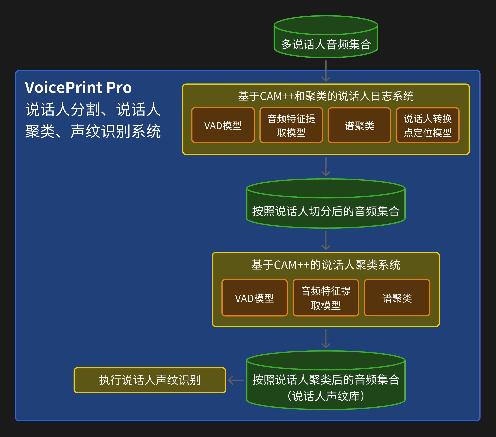
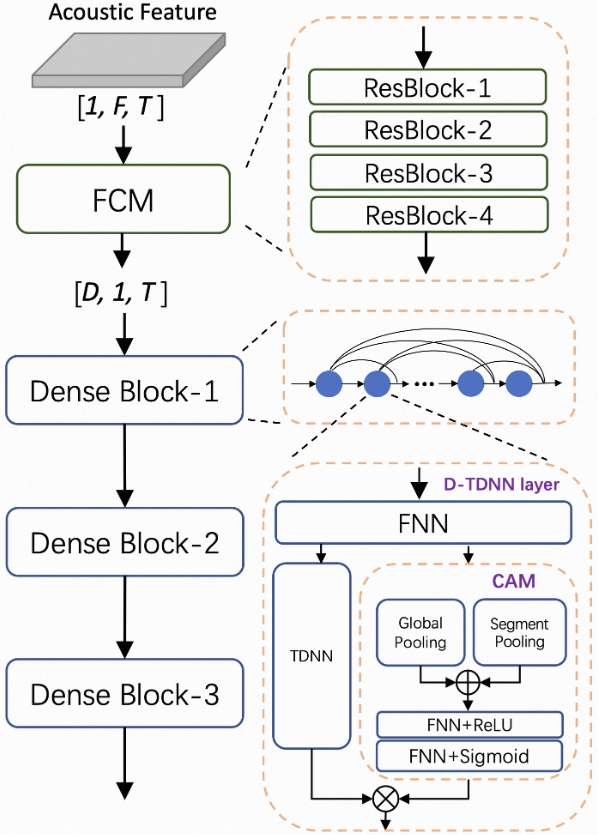
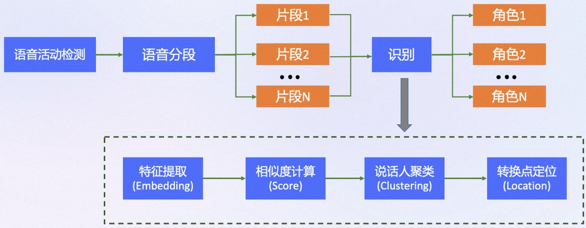

# VoicePrint Pro——说话人分割及聚类系统

**开发单位**: Beijing Institute of Technology · DataHammer Group
**版本**: Beta 1.0

## 项目简介

该项目实现了一个说话人聚类系统，该系统通过处理音频文件来识别和聚类说话人，基于他们的声音特征。该系统利用各种脚本和配置来执行语音活动检测(VAD)、提取说话人嵌入向量，并聚类这些嵌入向量以生成说话人身份。最后，它将结果组织成一个说话人声纹库。

## 项目架构

该系统使用了以下模型架构：


## 文档说明

- **conf/diar.yaml**：说话人分割过程的配置设置，包括特征提取参数、嵌入模型和聚类设置。

- **local/**：包含处理音频文件的脚本：
  - 说话人分割系统
    - **audio_diarization.py**：音频切割，将上传的多个音频文件区分说话人切割成多个音频文件。切分后，一个说话人对应一个单独的文件。生成的切分后数据集及元数据保存在workspace/dataset/文件夹中。
  - 说话人聚类系统
    - **voice_activity_detection.py**：使用预训练VAD模型对音频文件执行语音活动检测，并输出包含检测到的语音片段的JSON文件。生成的json文件保存在workspace/vad/文件夹中。
    - **prepare_subseg_json.py**：在进行嵌入向量提取前，从VAD结果生成用于嵌入提取的子片段JSON文件。生成的子片段json文件保存在workspace/vad/文件夹中。
    - **extract_diar_embeddings.py**：使用预训练的声纹向量提取模型从音频文件中提取说话人嵌入向量并以指定格式保存结果。生成的嵌入文件。生成的音频声纹嵌入文件保存在workspace/emb/文件夹中。
    - **cluster_and_postprocess.py**：聚类提取的嵌入向量并生成结果，并依据聚类结果构建说话人声纹库。生成的聚类结果保存在workspace/result文件夹中，说话人声纹库保存在workspace/result/voiceprintlib

- **utils/**：包含用于屏蔽：
  - **audio_utils.py**：用于加载和操作音频数据的实用函数。
  - **io_suppressor.py**：用于屏蔽modelscope.pipeline控制台输出的类

- **run_audio_diarization-cluster.sh**：主脚本，协调整个处理过程，输入待分割和聚类的音频文件目录，执行说话人分割、VAD、嵌入提取、聚类和声纹库生成。

## 使用方法

### 环境要求

1. **环境创建**：创建conda环境并激活：
    ```bash
    conda create -n VoicePrint_Pro python=3.8

    # 或者，你想创建在指定目录下：
    # conda create python=3.8 --prefix path/to/your/envs/VoicePrint_Pro
    # 对于特定目录下的conda环境，激活方式为：
    # conda activate path/to/your/envs/VoicePrint_Pro

    # 【换源下载（可选）】使用国内源下载
    # conda create -n VoicePrint_Pro python=3.8 -c https://mirrors.tuna.tsinghua.edu.cn/anaconda/pkgs/free/
    ```

2. **安装依赖**：确保您已安装所需的Python包。您可以使用`pip`安装`requirements.txt`文件中列出的必要库。
    ```bash
    # 确保你在新创建的conda环境中
    conda activate VoicePrint_Pro

    # 打开项目目录
    cd /path/to/your/VoicePrint_Pro

    # 安装librosa相关依赖
    conda install -c conda-forge sox
    # 安装其他相关依赖
    pip install -r requirements.txt

    # 【换源下载（可选）】使用国内源下载
    # conda install -c https://mirrors.tuna.tsinghua.edu.cn/anaconda/cloud/conda-forge/ sox
    # pip install -r requirements.txt -i https://pypi.tuna.tsinghua.edu.cn/simple
    ```

### 参数说明

使用以下命令执行`run_audio_diarization-cluster.sh`脚本：

```bash
./run_audio_diarization-cluster.sh --audio_dir <输入目录> --workspace <工作区> --proc_per_node <每节点进程数> --run_stage <运行阶段> --gpus <gpu列表> --use_gpu(可选参数)
```

- `--audio_dir`：包含`.wav`文件的目录路径。文件夹名为.wav音频对应的语言，如`chinese`、`english`、`russian`等。
- `--workspace`：存储结果的工作目录路径。
- `--num_speakers`：指定说话人分割系统要分割的说话人数量。默认值为2，即默认输入的原始音频中每条音频包含2个说话人。
- `--gpus`：用于处理的GPU编号。输入格式如"0"(使用cuda:0)，"1 2"(使用cuda:1和cuda:2) ，需要搭配`--use_gpu`参数使用。
- `--use_gpu` : 是否使用gpu进行处理，不指定该参数默认为False，给出--use_gpu参数则为True
- `--proc_per_node`：每个节点（gpu）上运行的进程数。
- `--run_stage`：管道中要运行的阶段。选项包括：
  - 阶段1：准备推理数据集，生成元数据
  - 阶段2：对每个音频文件执行VAD
  - 阶段3：提取说话人嵌入向量
  - 阶段4：聚类嵌入向量，并依据聚类结果构建说话人声纹库
  - 阶段5：评估并生成结果
- `--help`：显示脚本的帮助信息。
  您可以通过运行以下命令查看帮助信息：

```bash
./run_audio_diarization-cluster.sh --help
```

### 实验示例

实验运行示例：

```bash
# 确保当前脚本具有可执行权限
chmod +x run_audio_diarization-cluster.sh
```

1. 实验1：demo_chinese_10_wavs 将10条中文音频文件进行说话人分割并聚类
```bash
./run_audio_diarization-cluster.sh --audio_dir "./example/chinese" --workspace "./workspace/demo_chinese_10_wavs" --num_speakers 2 --proc_per_node 8 --run_stage "1 2 3 4" --gpus "0" --use_gpu
```

2. 实验2：demo_english_10_wavs 将10条英文音频文件进行说话人分割并聚类
```bash
./run_audio_diarization-cluster.sh --audio_dir "./example/english" --workspace "./workspace/demo_english_10_wavs" --num_speakers 2 --proc_per_node 8 --run_stage "1 2 3 4" --gpus "0" --use_gpu
```

3. 实验3：demo_russian_10_wavs 将10条俄语音频文件进行说话人分割并聚类
```bash
./run_audio_diarization-cluster.sh --audio_dir "./example/russian" --workspace "./workspace/demo_russian_10_wavs" --num_speakers 2 --proc_per_node 8 --run_stage "1 2 3 4" --gpus "0" --use_gpu
```

### 实验输出

脚本将在指定的工作区下生成目录结构，包含说话人分割过程的结果，包括：
   - **音频文件**：切分后的音频文件。保存在`workspace/dataset/`目录中。
   - **VAD结果**：包含检测到的语音片段的JSON文件。保存在`workspace/vad/`目录中。
   - **嵌入结果**：包含提取的说话人嵌入向量的文件。保存在`workspace/emb/`目录中。
   - **聚类结果**：组织有聚类音频片段和说话人身份的目录。保存在`workspace/result/`目录中。
   - **说话人声纹库**：包含每个说话人的音频片段和对应的声纹向量。保存在`workspace/result/voiceprintlib`目录中。

## 技术细节

### CAM++说话人声纹特征提取模型

#### 模型概述

该模型旨在提取音频片段的声纹特征向量。在说话人分割系统和说话人聚类系统中都使用了该模型。

CAM++模型是基于密集连接时延神经网络的声纹特征提取模型，具有准确的声纹特征提取效果和更快的推理速度。该模型使用大规模的中英文说话人数据集进行训练，适用于中英文语种的声纹特征提取任务，并具有较高的语言延展性，可以通过微调用于其他种语言的声纹特征提取任务。

详细信息参考论文：《CAM++: A Fast and Efficient Network for Speaker Verification Using Context-Aware Masking》 https://arxiv.org/abs/2303.00332

#### 模型架构

CAM++常用于说话人识别（区分）任务，兼顾识别性能和推理效率，在公开的中文数据集CN-Celeb和英文数据集VoxCeleb上，相比主流的说话人识别模型ResNet34和ECAPA-TDNN，获得了更高的准确率，同时具有更快的推理速度。

其模型结构如下图所示，整个模型包含两部分，残差卷积网络作为前端，密集连接时间延迟神经网络（D-TDNN）作为主干。前端模块是2维卷积结构，用于提取更加局部和精细的时频特征。主干模块采用密集型连接，复用层级特征，提高计算效率。同时每一层中嵌入了一个轻量级的上下文相关的掩蔽(Context-aware Mask)模块，该模块通过多粒度的pooling操作提取不同尺度的上下文信息，生成的mask可以去除掉特征中的无关噪声，并保留关键的说话人信息。

CAM++模型的结构如下图所示：


### 说话人分割系统

#### 系统概述

本系统是一个基于CAM++和聚类的说话人分割系统，该系统使用了深度学习模型来提取音频片段的声纹特征，并通过聚类算法将相似的声纹进行分组，从而实现说话人的区分，并依据此进行音频分割。

本系统旨在解决“区分谁在什么时候说话”的问题，将1条包含多个说话人的音频切分成num_speakers个单独的音频片段（num_speakers可指定），每条音频片段对应一个说话人。

例如，输入音频input_audio.wav长度为1 min，其中包含两个人的对话（num_speakers = 2），系统将会把该1 min的音频切分成2个音频片段input_audio_speaker0.wav和input_audio_speaker1.wav，分别对应说话人0和说话人1，每个音频片段的时间长度等于原音频长度1 min，但只包含一个说话人的语音。

#### 系统架构

本模型是基于分段-聚类（segmentation-clustering）模块化的框架，整个流程可分为5个部分：
1. 首先使用语音活动端点检测（Voice activity Detection，VAD）模块去除输入音频中的非人声部分
2. 然后将音频按照固定的窗移和窗长进行切段
3. 随后利用声纹特征提取模型提取这些音频段中的说话人特征
4. 最后对这些特征进行聚类（谱聚类），识别出每个人的音频段，输出相应的时间信息。在确定说话人转换点的位置配套使用了说话人转换点识别模型，让识别更准确。
5. 最后依据输出的时间戳信息切分音频，输出每个说话人的音频片段。

该系统的整体架构如下图所示：


每个模块使用的具体模型：
1. VAD模型：FSMN语音端点检测-中文-通用-16k https://modelscope.cn/models/damo/speech_fsmn_vad_zh-cn-16k-common-pytorch/summary
2. 声纹特征提取模型：CAM++说话人确认-中文-通用-200k-Spkrs https://modelscope.cn/models/damo/speech_campplus_sv_zh-cn_16k-common/summary
3. 说话人转换点定位模型：CAM++说话人转换点定位-两人-中文 https://modelscope.cn/models/damo/speech_campplus-transformer_scl_zh-cn_16k-common/summary

#### 输入接口

```bash
python ${SCRIPT_DIR}/local/audio_diarization.py --input_dir "$audio_dir" --workspace "$workspace" --num_speakers "$num_speakers" --gpu "$gpus" --use_gpu
```
- `input_dir`：包含待处理音频文件的目录路径。文件夹名为.wav音频对应的语言。
- `num_speakers`：指定要分割的说话人数量。默认值为2。
- `workspace`：存储结果的工作目录路径。
- `gpu`：用于处理的GPU编号。输入格式如"0"(使用cuda:0)，"1 2"(使用cuda:1和cuda:2)
- `use_gpu` : 是否使用gpu进行处理，不指定该参数默认为False，给出--use_gpu参数则为True

#### 输出接口

- `workspace/dataset/`：将在workspace目录下构建dataset文件夹，包含切分前及切分后的音频文件。每个说话人对应一个单独的文件，命名格式为`{source audio name}_speaker{i}.wav`，其中i表示说话人的编号（从0开始）。同时，生成metadata.csv文件，包含每个分割后音频片段的音频文件名,对应分割前音频的音频文件名,说话人id,语种等信息

  构建得到的workspace/dataset文件夹格式应如
  ```bash
  - workspace/dataset
    - dataset  
    - audio
      - audio_1.wav
      - audio_2.wav
      - ...
    - audio_source
      - audio_1_speaker0.wav
      - audio_1_speaker1.wav
      - audio_2_speaker0.wav
      - audio_2_speaker1.wav
      - ...
    - metadata.csv
  ```

  生成的metadata.csv文件格式应如
  ```csv
  # metadata.csv
  wav_name,source_name,speaker_id,language
  audio_1_speaker0.wav,audio_1.wav,0,Chinese
  audio_1_speaker1.wav,audio_1.wav,1,Chinese
  audio_2_speaker0.wav,audio_2.wav,0,Chinese
  audio_2_speaker1.wav,audio_2.wav,1,Chinese
  ```

### 说话人聚类系统

#### 系统概述

本系统是一个基于CAM++和聚类的的说话人聚类系统，该系统使用了深度学习模型来提取音频片段的声纹特征，并通过聚类算法将相似的声纹进行分组，从而实现说话人的区分，并依据此进行音频聚类。

本系统旨在解决“将不同说话人的音频片段进行聚类”的问题，将多条经由说话人分割系统切分后的音频片段进行聚类，将同属于同一说话人的音频片段聚类到一起，输出每个说话人对应的所有音频片段和该说话人的声纹向量。并在最后依据聚类结果构建说话人声纹库。

例如，输入一个包含多个说话人的音频片段的音频列表（分割后的音频，每条音频中只包含一个说话人）：audio1_speaker0.wav, audio1_speaker1.wav, audio2_speaker0.wav, audio2_speaker1.wav,，系统将会计算每条音频片段的声纹嵌入向量，并将相似的声纹进行聚类，作为同一个说话人的音频片段，输出每个说话人对应的所有音频片段和该说话人的声纹向量。假设audio1_speaker0.wav与audio2_speaker1.wav同属于一个说话人的音频片段，则系统将会将audio1_speaker0.wav和audio2_speaker1.wav聚类为同一类。最后，系统将依据聚类结果构建说话人声纹库，包含每个说话人的音频片段和对应说话人的声纹向量。

#### 系统架构

该系统的整体架构与说话人分割系统类似，但是在声纹特征提取及声纹聚类部分的行为略有区别。整个流程可分为5个部分。
1. 首先使用语音活动端点检测（Voice activity Detection，VAD）模块去除输入音频中的非人声部分
2. 然后将每条音频按照固定的窗移和窗长切成多条子段
3. 随后利用声纹特征提取模型提取每条音频段中的说话人声纹特征，**通过将同一条输入音频的所有子音频段的声纹特征向量进行平均，得到该条音频的声纹特征向量**。
4. 最后对每条音频的声纹特征向量进行聚类（谱聚类），聚类相似的声纹特征向量，将属于同一个说话人的音频片段聚类到一起。
5. 依据聚类结果构建说话人声纹库，包含每个说话人的音频片段和对应的声纹向量，**通过将属于同一说话人的所有音频的声纹特征向量进行平均，作为该说话人的声纹特征向量**。

这部分使用的声纹特征提取模型与说话人分割系统也略有不同：CAM++说话人确认-通用-16k-中英文版 https://www.modelscope.cn/models/iic/speech_campplus_sv_zh_en_16k-common_advanced

#### 输入接口

1. 使用VAD模型去除输入音频中的非人声部分
  ```bash
  torchrun --nproc_per_node=$proc_per_node ${SCRIPT_DIR}/local/voice_activity_detection.py --workspace ${workspace} --gpu $gpus --use_gpu
  ```
  - `proc_per_node`：每个节点（gpu）上并行运行的进程数（并行处理多条数据）。
  - `workspace`：存储结果的工作目录路径。
  - `gpu`：用于处理的GPU编号。输入格式如"0"(使用cuda:0)，"1 2"(使用cuda:1和cuda:2)
  - `use_gpu` : 是否使用gpu进行处理，不指定该参数默认为False，给出--use_gpu参数则为True


2. 将每条音频按照固定的窗移和窗长切成多条子段
  ```bash
  torchrun --nproc_per_node=$proc_per_node ${SCRIPT_DIR}/local/prepare_subseg_json.py --workspace ${workspace} --dur 1.0 --shift 0.5 --min_seg_len 0.5 --max_seg_num 150
  ```
  - `proc_per_node`：每个节点（gpu）上并行运行的进程数（并行处理多条数据）。
  - `workspace`：存储结果的工作目录路径。
  - `dur`：每条子音频段的时长，单位为秒。默认值为1.0秒。
  - `shift`：每条子音频段的窗移，单位为秒。默认值为0.5秒。
  - `min_seg_len`：每条子音频段的最小时长，单位为秒。默认值为0.5秒。低于该最小时长的子音频段将被丢弃。
  - `max_seg_num`：每条音频的最大子段数。默认值为150。超过该最大子段数的子音频段将被丢弃，仅计算前150条子音频段的声纹特征向量。


3. 利用声纹特征提取模型提取每条音频段中的说话人声纹特征
  ```bash
  torchrun --nproc_per_node=$proc_per_node ${SCRIPT_DIR}/local/extract_diar_embeddings.py --workspace ${workspace} --model_id $speaker_model_id --conf $conf_file --batchsize 64 --gpu $gpus --use_gpu
  ```
  - `proc_per_node`：每个节点（gpu）上并行运行的进程数（并行处理多条数据）。
  - `workspace`：存储结果的工作目录路径。
  - `model_id`：声纹特征提取模型的ID。默认值为"iic/speech_campplus_sv_zh_en_16k-common_advanced"(CAM++说话人确认-通用-16k-中英文版)。
  - `conf`：声纹特征提取模型的配置文件路径。默认值为"conf/diar.yaml"。
  - `batchsize`：每个批次的音频段数。默认值为64。
  - `gpu`：用于处理的GPU编号。输入格式如"0"(使用cuda:0)，"1 2"(使用cuda:1和cuda:2)
  - `use_gpu` : 是否使用gpu进行处理，不指定该参数默认为False，给出--use_gpu参数则为True

4. 对每条音频的声纹特征向量进行聚类，并依据聚类结果构建说话人声纹库
  ```bash
  python ${SCRIPT_DIR}/local/cluster_and_postprocess.py --workspace ${workspace} --conf $conf_file 
  ```
  - `workspace`：存储结果的工作目录路径。
  - `conf`：聚类模型的配置文件路径。默认值为"conf/diar.yaml"，使用谱聚类。

#### 输出接口

- `workspace/vad/`：将在workspace目录下构建vad文件夹，包含VAD结果的JSON文件及每条音频的所有子音频段的JSON文件。每个音频片段对应一个单独的vad文件及一个单独的子片段信息文件，命名格式分别为`{audio name}_vad.json`及`{audio name}_subseg.json`。其中包含含人声片段的起止时间戳信息，对应音频文件名。
- `workspace/emb/`：将在workspace目录下构建emb文件夹，包含每条音频对应的声纹嵌入向量。每个音频片段对应一个单独的文件，命名格式为`{audio name}.pkl`。其中包含每个子音频段的声纹嵌入向量及子段对应的时间戳信息，并包含该条音频的声纹嵌入向量的平均值。格式如下：
  ```python
  stat_obj = {
                'embeddings': embeddings,
                'times': [[meta[key]['start'], meta[key]['stop']] for key in valid_meta_keys],
                'avg_embedding': avg_embedding
            }
  ```
- `workspace/result/`：将在workspace目录下构建result文件夹，包含聚类结果的JSON文件。包含`cluster_result.csv`及`cluster_result.txt`。包含聚类得到的每个说话人对应的所有音频文件列表。格式如：
  ```csv
  # cluster_result.csv
  wav_name,speaker_id_pred,language
  zh_10_speaker0.wav,0,zh-cn
  zh_1_speaker1.wav,0,zh-cn
  ```

  ```txt
  # cluster_result.txt
  speaker_0:
      ./workspace/demo_chinese_10_wavs/dataset/audio/zh_10_speaker0.wav
      ./workspace/demo_chinese_10_wavs/dataset/audio/zh_1_speaker1.wav

  speaker_1:
      ./workspace/demo_chinese_10_wavs/dataset/audio/zh_10_speaker1.wav
      ./workspace/demo_chinese_10_wavs/dataset/audio/zh_2_speaker0.wav
      ...
  ```
- `workspace/result/voiceprintlib/`：将在workspace目录下构建result/voiceprintlib文件夹，包含每个说话人的音频片段和该说话人的声纹向量。目录格式如下：
  ```bash
  - workspace/result/voiceprintlib
    - speaker_0
      - audio
        - zh_10_speaker0.wav
        - zh_1_speaker1.wav
        - ...
      - speaker_0_voiceprint.pkl
    - speaker_1
      - audio
        - zh_10_speaker1.wav
        - zh_2_speaker0.wav
        - ...
      - speaker_1_voiceprint.pkl
    - ...
  ```
  其中speaker_{i}_voiceprint.pkl中包含聚类为第i个说话人对应的所有音频片段的声纹向量，及通过平均得到的该说话人的声纹向量。格式如下：
  ```python
  voiceprint_data = {
            'audio': audio_filenames,
            'avg_embeddings': speaker_avg_embeddings,
            'avg_voiceprint': speaker_voiceprint
        }
  ```

## work in progress

1. 使用更大规模的数据集开展全面的评估，包括说话人分割准确率，聚类效果等指标的评估。
2. 开发语音转文字模块
3. 重设模型接口及
