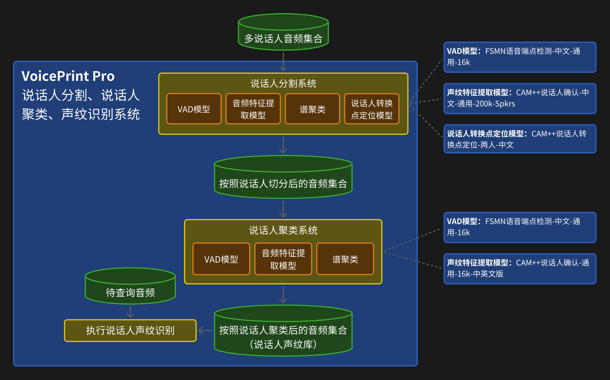

# 说话人聚类系统

该项目实现了一个说话人聚类系统，该系统通过处理音频文件来识别和聚类说话人，基于他们的声音特征。该系统利用各种脚本和配置来执行语音活动检测(VAD)、提取说话人嵌入向量，并聚类这些嵌入向量以生成说话人身份。最后，它将结果组织成一个说话人声纹库。

## 项目结构

- **conf/diar.yaml**：说话人分割过程的配置设置，包括特征提取参数、嵌入模型和聚类设置。
  
- **data/README.md**：关于项目中数据结构和使用的文档。

- **local/**：包含处理音频文件的脚本：
  - **audio_diarization.py**：音频切割，将上传的多个音频文件区分说话人切割成多个音频文件。切分后，一个说话人对应一个单独的文件。生成的切分后数据集及元数据保存在workspace/dataset/文件夹中。
  - **voice_activity_detection.py**：使用预训练VAD模型对音频文件执行语音活动检测，并输出包含检测到的语音片段的JSON文件。生成的json文件保存在workspace/vad/文件夹中。
  - **prepare_subseg_json.py**：在进行嵌入向量提取前，从VAD结果生成用于嵌入提取的子片段JSON文件。生成的子片段json文件保存在workspace/vad/文件夹中。
  - **extract_diar_embeddings.py**：使用预训练的声纹向量提取模型从音频文件中提取说话人嵌入向量并以指定格式保存结果。生成的嵌入文件。生成的音频声纹嵌入文件保存在workspace/emb/文件夹中。
  - **cluster_and_postprocess.py**：聚类提取的嵌入向量并生成结果，并依据聚类结果构建说话人声纹库。生成的聚类结果保存在workspace/result文件夹中，说话人声纹库保存在workspace/result/voiceprintlib

- **utils/**：包含用于屏蔽：
  - **audio_utils.py**：用于加载和操作音频数据的实用函数。
  - **visualization.py**：用于可视化说话人分割和聚类过程结果的函数。
  - **io_suppressor.py**：用于屏蔽modelscope.pipeline控制台输出的函数

- **run_audio_diarization-cluster.sh**：主脚本，协调整个处理过程，输入待分割和聚类的音频文件目录，执行说话人分割、VAD、嵌入提取、聚类和声纹库生成。

## 使用方法

1. **安装依赖**：确保您已安装所需的Python包。您可以使用`pip`安装`requirements.txt`文件中列出的必要库。
    ```bash
    pip install -r requirements.txt
    ```

2. **运行脚本**：使用以下命令执行`run_audio_diarization-cluster.sh`脚本：
   ```bash
   ./run_audio_diarization-cluster.sh --audio_dir <输入目录> --workspace <工作区> --gpus <gpu列表> --proc_per_node <每节点进程数> --run_stage <运行阶段>
   ```
    - `--audio_dir`：包含`.wav`文件的目录路径。文件夹名为.wav音频对应的语言。
    - `--workspace`：存储结果的工作目录路径。
    - `--gpus`：用于处理的GPU编号。输入格式如"0"(使用cuda:0)，"1 2"(使用cuda:1和cuda:2) 
    - `--use_gpu` : 是否使用gpu进行处理，不指定该参数默认为False，给出--use_gpu参数则为True
    - `--proc_per_node`：每个节点（gpu）上运行的进程数。
    - `--run_stage`：管道中要运行的阶段。选项包括：
        - 阶段1：准备推理数据集，生成元数据
        - 阶段2：对每个音频文件执行VAD
        - 阶段3：提取说话人嵌入向量
        - 阶段4：聚类嵌入向量，并依据聚类结果构建说话人声纹库
        - 阶段5：评估并生成结果

    您可以通过运行以下命令查看帮助信息：
    ```bash
    ./run_audio_diarization-cluster.sh --help
    ```
    - `--help`：显示脚本的帮助信息。

    示例：
    ```bash
    # 实验1：demo_chinese_10_wavs
    ./run_audio_diarization-cluster.sh --audio_dir "./example/chinese" --workspace "./workspace/demo_chinese_10_wavs" --proc_per_node 8 --run_stage "1 2 3 4" --gpus "1" --use_gpu

    # 实验2：demo_english_10_wavs
    ./run_audio_diarization-cluster.sh --audio_dir "./example/english" --workspace "./workspace/demo_english_10_wavs" --proc_per_node 8 --run_stage "1 2 3 4" --gpus "1" --use_gpu

    # 实验3：demo_aishell-1_7_speakers_35_wavs 识别每2个说话人
    ./run_audio_diarization-cluster.sh --audio_dir "./example/russian" --workspace "./workspace/demo_russian_10_wavs" --proc_per_node 8 --run_stage "1 2 3 4" --gpus "1" --use_gpu
    ```

3. **输出**：脚本将在指定的工作区下生成目录结构，包含说话人分割过程的结果，包括：
   - **音频文件**：切分后的音频文件。保存在`workspace/dataset/`目录中。
   - **VAD结果**：包含检测到的语音片段的JSON文件。保存在`workspace/vad/`目录中。
   - **嵌入结果**：包含提取的说话人嵌入向量的文件。保存在`workspace/emb/`目录中。
   - **聚类结果**：组织有聚类音频片段和说话人身份的目录。保存在`workspace/result/`目录中。
   - **说话人声纹库**：包含每个说话人的音频片段和对应的声纹向量。保存在`workspace/result/voiceprintlib`目录中。

## 技术细节

### 模型架构

该系统使用了以下模型架构：


首先

### API接口

#### 输入接口

#### 输出文件

### 