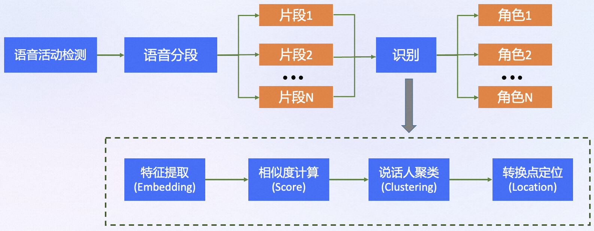

---
tasks:
- speaker-diarization
model_type:
- CAM++-cluster
domain:
- audio
frameworks:
- pytorch
backbone:
- CAM++-cluster
license: Apache License 2.0
language:
- cn
tags:
- speaker diarization
- 角色区分
- 多人对话场景
- 自定义人数
widgets:
  - task: speaker-diarization
    model_revision: v1.0.0
    inputs:
      - type: audio
        displayType: AudioUploader
        name: input
        title: 音频
        validator:
          max_size: 100M
    examples:
      - inputs:
          - data: git://examples/2speakers_example.wav
      - inputs:
          - data: git://examples/2speakers_example.wav
    output:
        displayType: Text
        displayValueMapping: text
    inferencespec:
      cpu: 8 #CPU数量
      memory: 1024
---

# 基于CAM++和聚类的说话人日志系统
输入一段多人对话的音频，本模型可以自动的识别音频中的对话人数，并且对其进行区分，适合用于客服对话、会议讨论、采访等场景，该系统配合语音识别可进一步搭建多人对话的语音识别系统。

## 模型简述
本模型是基于分段-聚类（segmentation-clustering）模块化的框架，整个流程可分为4个部分，首先使用语音活动端点检测（Voice activity Detection，VAD）模块去除输入音频中的非人声部分，然后将音频按照固定的窗移和窗长进行切段，随后利用说话人模型提取这些音频段中的说话人特征，最后对这些特征进行聚类，识别出每个人的音频段，输出相应的时间信息。在确定说话人转换点的位置如果配套使用说话人转换点识别模型，识别会更准确。

<div align=center>

</div>

## 对比端到端说话人日志系统
目前学术界较为流行端到端的diarization框架中，单独的一个网络结构负责上述的全部4个功能。该框架在一些方面具有明显的优势，例如能够输出音频帧级的说话人标签，可以处理多人同时说话人的情况等。但是目前也存在较为明显的局限性，例如在测试数据和训练数据不匹配、说话人数过多、长音频段场景下表现不佳。所以目前通用性上，基于分段-聚类的说话人日志系统仍存在一定的优势。

## 当前版本框架中每个模块使用的具体模型
 - VAD模型，[FSMN语音端点检测-中文-通用-16k](https://modelscope.cn/models/damo/speech_fsmn_vad_zh-cn-16k-common-pytorch/summary)
 - 说话人模型，[CAM++说话人确认-中文-通用-200k-Spkrs](https://modelscope.cn/models/damo/speech_campplus_sv_zh-cn_16k-common/summary)
 - 说话人转换点定位模型，[CAM++说话人转换点定位-两人-中文](https://modelscope.cn/models/damo/speech_campplus-transformer_scl_zh-cn_16k-common/summary)

## 模型效果评估
采用说话人区分错误率（Diarization Error Rate，DER）作为评估标准。
| 测试集 | DER |
|:-----:|:------:|
|2人真实对话测试集|4.7%|
|2-10人真实对话测试集|8.0%|

# 如何快速体验模型效果
如果在本地使用，需要先安装modelscope并配置相应的环境，相关教程请参考[这里](https://modelscope.cn/docs/%E7%8E%AF%E5%A2%83%E5%AE%89%E8%A3%85)。
对于有开发需求的使用者，特别推荐您使用Notebook进行离线处理。先登录ModelScope账号，点击模型页面右上角的“在Notebook中打开”按钮出现对话框，首次使用会提示您关联阿里云账号，按提示操作即可。关联账号后可进入选择启动实例界面，选择计算资源，建立实例，待实例创建完成后进入开发环境，输入api调用实例。
``` python
# 版本要求 modelscope version 升级至最新版本 funasr 升级至最新版本
from modelscope.pipelines import pipeline
sd_pipeline = pipeline(
    task='speaker-diarization',
    model='damo/speech_campplus_speaker-diarization_common',
    model_revision='v1.0.0'
)
input_wav = 'https://modelscope.cn/api/v1/models/damo/speech_campplus_speaker-diarization_common/repo?Revision=master&FilePath=examples/2speakers_example.wav'
result = sd_pipeline(input_wav)
print(result)
# 如果有先验信息，输入实际的说话人数，会得到更准确的预测结果
result = sd_pipeline(input_wav, oracle_num=2)
print(result)
```
# 在3D-Speaker上使用
本项目已发布在[3D-Speaker](https://github.com/alibaba-damo-academy/3D-Speaker)，使用者可按下面方式下载安装使用：
``` sh
git clone https://github.com/alibaba-damo-academy/3D-Speaker.git && cd 3D-Speaker
conda create -n 3D-Speaker python=3.8
conda activate 3D-Speaker
pip install -r requirements.txt
```

快速推理
``` sh
cd egs/3dspeaker/speaker-diarization
pip install -r requirements.txt
bash run.sh
```
# 模型的局限性
在音频有效时长过短（小于30s）和说话人数过多（超过10人）时可能表现不佳。另外本模型最终的效果高度依赖每个模块的性能，因此如果换用更加符合测试场景模块，识别准确性可能会更高。

# 3D-Speaker 开发者社区钉钉群
<div align=left>

</div>
